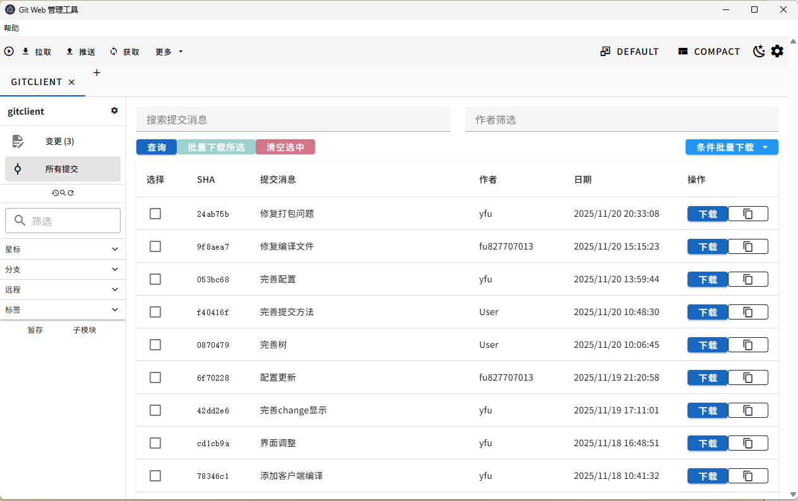
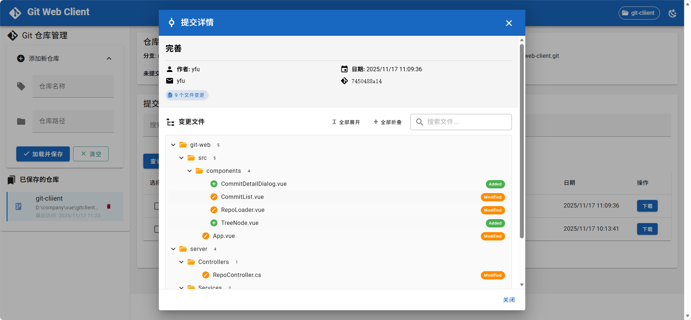
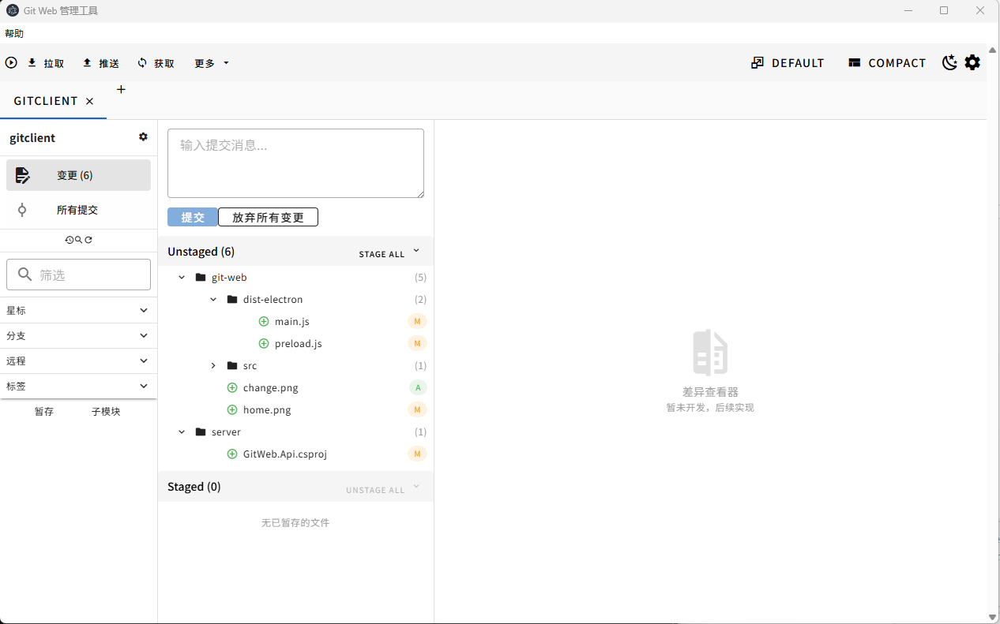

# Git 仓库可视化管理工具

## 项目简介

**项目名称**：Git 仓库可视化管理工具 \
**项目定位**：基于 Electron + Vue 3 的桌面端 Git 仓库管理工具，提供直观的可视化操作界面\
**核心价值**：简化 Git 仓库管理流程，提供图形化的提交历史查看和文件管理功能\
**部署方式**：Windows 桌面客户端 (Electron) / Web 浏览器\
**架构模式**：前后端分离架构，Vue 3 + Vuetify UI + .NET Core Web API

---

## 界面预览

### 首页 - 仓库管理与提交历史



**主要功能：**
- 左侧导航栏：仓库管理（添加新仓库、已保存仓库列表）
- 顶部应用栏：当前仓库显示、主题切换
- 仓库状态卡片：显示当前分支、远程仓库地址、未提交/未推送文件数
- 提交历史列表：
  - 搜索和筛选功能
  - 多选提交记录进行批量下载
  - 支持 Shift 键进行范围选择
  - 右键菜单快捷操作

### 提交详情查看 - 树形文件结构



**主要功能：**
- 提交信息展示：作者、邮箱、日期、SHA、完整提交消息
- 变更文件统计：显示变更文件总数
- 树形文件结构：
  - 按目录层级组织显示
  - 支持文件夹展开/折叠
  - 全部展开/折叠快捷按钮
  - 文件状态标识（Added、Modified、Deleted 等）
  - 彩色状态标签区分不同操作类型
  - 搜索过滤文件
  - 重命名文件显示原路径

### 本地文件变更 - 树形文件结构



---

## 核心特性

### 🎯 多仓库管理
- ✅ **Tab 标签页管理**：支持同时打开多个仓库，Tab 切换操作
- ✅ **仓库配置持久化**：仓库信息自动保存，下次启动恢复
- ✅ **快速添加仓库**：通过 + 按钮快速添加本地 Git 仓库
- ✅ **仓库状态提示**：Tab 标签显示未保存更改状态（*标记）
- ✅ **最近访问记录**：自动记录和排序最近使用的仓库

### 📊 提交历史查看
- ✅ **分页加载**：高效处理大型仓库，支持滚动加载更多
- ✅ **智能搜索**：按提交消息关键词实时搜索
- ✅ **作者筛选**：按提交作者过滤显示
- ✅ **批量选择**：支持 Shift 键范围选择和 Ctrl 键多选
- ✅ **右键菜单**：查看详情、下载文件、复制 SHA 等快捷操作
- ✅ **视觉化分支线**：图形化显示分支合并关系

### 📁 文件管理
- ✅ **树形文件结构**：按目录层级组织，直观展示项目结构
- ✅ **状态标识**：彩色标签区分 Added、Modified、Deleted、Renamed 等状态
- ✅ **智能折叠**：支持全部展开/折叠，记忆用户操作
- ✅ **文件搜索**：快速过滤定位特定文件
- ✅ **批量下载**：支持单个或批量提交的文件下载
- ✅ **变更统计**：实时显示变更文件数量和类型

### 🎨 现代化界面
- ✅ **Material Design 3**：采用最新的 Material Design 设计规范
- ✅ **深色/浅色主题**：一键切换，自动保存用户偏好
- ✅ **响应式布局**：自适应不同屏幕尺寸
- ✅ **左侧导航栏**：分支管理、标签查看、暂存区操作
- ✅ **底部详情面板**：可折叠的提交详情查看区域
- ✅ **流畅动画**：平滑的过渡效果和交互反馈

---

## 技术栈

### 前端技术
- **框架**：Vue 3.3+ (Composition API)
- **UI 组件库**：Vuetify 3.10+（Material Design 3）
- **状态管理**：Pinia 3.0+
- **HTTP 客户端**：Axios 1.7+
- **树形组件**：@he-tree/vue 2.10+
- **构建工具**：Vite 5.0+
- **桌面框架**：Electron 39+
- **包管理器**：npm/yarn

### 后端技术
- **框架**：.NET Core 10 (ASP.NET Core Web API)
- **Git 操作库**：LibGit2Sharp
- **序列化**：System.Text.Json
- **CORS 支持**：Microsoft.AspNetCore.Cors
- **C# 版本**：C# 12+

### 开发环境要求
- **Node.js**: 18.0+ (推荐 20.x LTS)
- **.NET SDK**: 10.0+
- **Git**: 2.40+
- **操作系统**: Windows 10/11 (64位)
- **IDE 推荐**: VS Code / Visual Studio 2022

---

## 项目结构

```
git-cliient/
├── git-web/                          # 前端项目
│   ├── electron/                    # Electron 主进程代码
│   │   ├── main.js                 # 主进程入口（窗口管理）
│   │   └── preload.js              # 预加载脚本（安全桥接）
│   ├── src/                        # Vue 3 源码
│   │   ├── components/             # UI 组件
│   │   │   ├── Toolbar.vue        # 顶部工具栏
│   │   │   ├── RepoTabs.vue       # 仓库Tab标签栏
│   │   │   ├── LeftNavigation.vue # 左侧导航面板
│   │   │   ├── CommitList.vue     # 提交历史列表
│   │   │   ├── ChangesView.vue    # 文件变更视图
│   │   │   └── BottomDetailPanel.vue # 底部详情面板
│   │   ├── stores/                # Pinia 状态管理
│   │   │   ├── repos.js          # 仓库管理
│   │   │   ├── git.js            # Git 操作
│   │   │   └── ui.js             # UI 状态
│   │   ├── api.js                # API 接口封装
│   │   ├── App.vue               # 根组件
│   │   └── main.js               # 应用入口
│   ├── resources/                 # 应用资源
│   │   └── icon.ico              # Windows 应用图标
│   ├── dist/                      # 前端构建输出
│   ├── dist-electron/             # Electron 构建输出
│   ├── release/                   # 安装包输出目录
│   ├── vite.config.js            # Vite 配置
│   ├── electron-builder.json     # Electron 打包配置
│   └── package.json              # 项目依赖配置
├── server/                         # 后端 .NET 项目
│   ├── Controllers/              # API 控制器
│   │   ├── GitController.cs    # Git 操作接口
│   │   └── RepoController.cs   # 仓库管理接口
│   ├── Services/                # 业务服务层
│   │   ├── GitService.cs       # Git 操作服务
│   │   └── RepoConfigService.cs # 仓库配置服务
│   ├── Properties/              # 项目属性
│   ├── Program.cs              # 应用启动入口
│   └── GitWeb.Api.csproj       # 项目文件
├── .github/                     # GitHub 配置
├── README.MD                    # 项目主文档
├── QUICK_START.md              # 快速上手指南
├── ELECTRON_INTEGRATION.md     # Electron 集成文档
├── DOCS_INDEX.md              # 文档索引
├── LAYOUT_FINAL.MD            # 界面布局设计文档
├── start-dev.bat              # 开发环境启动脚本
└── build-release.bat          # 生产打包脚本
```

---

## 开发环境搭建

### 1. 克隆项目

```bash
git clone <repository-url>
cd git-cliient
```

### 2. 安装依赖

#### 前端依赖安装

```bash
cd git-web
npm install
```

**说明**：会自动安装 Vue、Vuetify、Electron 等所有前端依赖。

#### 后端依赖安装

```bash
cd server
dotnet restore
```

**说明**：会自动下载 .NET 项目所需的 NuGet 包。

---

## 开发环境运行

### 方式一：Electron 桌面应用模式（推荐）

开发 Electron 桌面应用时，需要同时运行前端、后端和 Electron：

#### 步骤 1：启动后端 API

打开**终端 1**：

```bash
cd server
dotnet run --urls "http://localhost:9002"
```

**运行成功标志**：
```
Now listening on: http://localhost:9002
Application started. Press Ctrl+C to shut down.
```

#### 步骤 2：启动前端开发服务器

打开**终端 2**：

```bash
cd git-web
npm run electron:dev
```

**运行成功标志**：
```
VITE v5.4.21  ready in XXX ms
➜  Local:   http://localhost:9001/
```

#### 步骤 3：启动 Electron 应用

打开**终端 3**：

```bash
cd git-web
npm run electron:start
```

**运行成功标志**：Electron 窗口自动打开，显示应用界面。

---

### 方式二：Web 浏览器模式

如果只想在浏览器中开发前端，可以不启动 Electron：

#### 步骤 1：启动后端 API

```bash
cd server
dotnet run --urls "http://localhost:9002"
```

#### 步骤 2：启动前端开发服务器

```bash
cd git-web
npm run dev
```

#### 步骤 3：打开浏览器

在浏览器中访问：`http://localhost:9001`

---

## 端口配置说明

| 服务 | 端口 | 说明 |
|------|------|------|
| 前端开发服务器 | 9001 | Vite Dev Server，提供热更新 |
| 后端 API | 9002 | .NET Web API，处理 Git 操作 |

**端口冲突处理**：

如果端口被占用，可以修改配置：
- 前端端口：修改 `git-web/vite.config.js` 中的 `server.port`
- 后端端口：修改 `server/Program.cs` 中的 `UseUrls` 配置

---

## 生产环境打包

### 完整打包流程

#### 步骤 1：发布后端 API（自包含模式）

在项目根目录执行：

```bash
cd server
dotnet publish -c Release -r win-x64 --self-contained true -p:PublishSingleFile=false
```

**参数说明**：
- `-c Release`：发布模式为 Release
- `-r win-x64`：目标平台为 Windows 64位
- `--self-contained true`：包含 .NET 运行时（用户无需安装 .NET）
- `-p:PublishSingleFile=false`：不打包为单文件（文件数量较多但启动更快）

**输出目录**：
```
server/bin/Release/net10.0/win-x64/publish/
```

#### 步骤 2：构建前端并打包 Electron 应用

```bash
cd git-web
npm run electron:build
```

**打包过程**：
1. Vite 构建前端代码 → `git-web/dist/`
2. 编译 Electron 主进程 → `git-web/dist-electron/`
3. electron-builder 打包应用 → `git-web/release/`

**输出文件**：
```
git-web/release/Git-Web-Client-Setup-1.0.0.exe
```

---

## 安装和分发

### Windows 安装程序

打包完成后，会在 `git-web/release/` 目录生成安装程序：

- **文件名**：`Git-Web-Client-Setup-1.0.0.exe`
- **安装类型**：NSIS 安装程序
- **安装大小**：约 250-300 MB（包含 .NET 运行时）

### 用户安装步骤

1. 双击 `Git-Web-Client-Setup-1.0.0.exe`
2. 选择安装目录（可自定义）
3. 点击"安装"，等待安装完成
4. 安装完成后，桌面和开始菜单会出现快捷方式

### 首次启动

1. 双击桌面快捷方式或从开始菜单启动
2. 应用窗口打开（1280x800）
3. 后端 API 自动在后台启动（端口 9002）
4. 点击"添加新仓库"开始使用

---

## 应用使用说明

### 1. 添加 Git 仓库

1. 点击左侧导航栏的 **"添加新仓库"** 按钮
2. 输入仓库名称（自定义，用于标识）
3. 输入或粘贴本地 Git 仓库的完整路径
   - 示例：`D:\Projects\my-project`
4. 点击"保存"，仓库会出现在左侧列表中

### 2. 查看提交历史

1. 在左侧仓库列表中，点击已保存的仓库
2. 右侧会自动加载该仓库的提交历史
3. 提交列表显示：
   - Commit SHA（前 7 位）
   - 提交消息
   - 作者
   - 提交日期
   - 变更文件数

### 3. 搜索和筛选

- **搜索提交消息**：在顶部搜索框输入关键词
- **按作者筛选**：点击作者筛选下拉框，选择特定作者

### 4. 查看提交详情

**方式 1：右键菜单**
1. 右键点击任意提交记录
2. 选择"查看提交详情"

**方式 2：直接点击**
- 双击提交记录行

**详情页功能**：
- 树形文件结构展示
- 文件状态标签（Added、Modified、Deleted 等）
- 全部展开/折叠按钮
- 文件搜索过滤

### 5. 下载文件

#### 单个提交下载

1. 点击提交记录右侧的"下载"按钮
2. 系统自动下载该提交涉及的所有变更文件
3. 文件保持原有目录结构

#### 批量提交下载

1. 勾选多个提交记录（支持 **Shift** 键范围选择）
2. 点击顶部的"批量下载所选"按钮
3. 系统按时间顺序下载，同名文件自动覆盖为最新版本

### 6. 主题切换

- 点击顶部工具栏的 **主题切换按钮**
- 支持浅色和深色主题

---

## 常见问题

### 1. 端口被占用

**问题**：启动时提示端口 9001 或 9002 被占用

**解决方案**：

查看占用端口的进程：
```bash
netstat -ano | findstr "9001"
netstat -ano | findstr "9002"
```

结束占用进程：
```bash
taskkill /PID <进程ID> /F
```

### 2. Electron 窗口打开后显示空白

**原因**：后端 API 未启动或启动失败

**解决方案**：
1. 检查终端是否显示"Now listening on: http://localhost:9002"
2. 手动启动后端：`cd server && dotnet run --urls "http://localhost:9002"`
3. 刷新 Electron 窗口（Ctrl + R）

### 3. 后端启动失败

**错误**：`Unable to bind to http://localhost:9002`

**解决方案**：
- 检查防火墙是否拦截
- 尝试以管理员身份运行终端
- 修改端口号（参考"端口配置说明"）

### 4. 前端无法调用后端 API

**错误**：浏览器控制台显示 CORS 错误或连接被拒绝

**解决方案**：
1. 确认后端已启动且监听 9002 端口
2. 检查 `server/Program.cs` 中的 CORS 配置
3. 确认前端 `git-web/src/api.js` 中的 baseURL 配置正确

### 5. 打包后安装程序无法运行

**问题**：双击 .exe 提示"Windows 已保护你的电脑"

**原因**：应用未签名，触发 Windows SmartScreen

**解决方案**：
- 点击"更多信息" → "仍要运行"
- 或者：为应用添加代码签名证书（需要购买证书）

### 6. 打包体积过大

**问题**：安装包超过 300 MB

**优化方案**：
1. 使用 `PublishTrimmed=true` 裁剪未使用的 .NET 库：
   ```bash
   dotnet publish -c Release -r win-x64 --self-contained true -p:PublishTrimmed=true
   ```
2. 使用 asar 压缩 Electron 资源（electron-builder 默认已启用）

### 7. 开发时热更新不生效

**解决方案**：
1. 确保 Vite 开发服务器正常运行
2. 检查终端是否有报错信息
3. 尝试手动刷新 Electron 窗口（Ctrl + R）
4. 重启 Vite 服务器

---

## 开发调试

### 打开 Electron DevTools

在 Electron 应用中按 **F12** 或 **Ctrl + Shift + I** 打开开发者工具。

### 查看主进程日志

主进程的 `console.log` 输出会显示在启动 Electron 的终端中。

### 查看渲染进程日志

渲染进程的日志显示在 DevTools 的 Console 面板。

### 查看后端日志

后端的日志输出显示在启动 `dotnet run` 的终端中。

---

## 技术文档

更多技术细节请参考：

- **[Electron 集成技术文档](./ELECTRON_INTEGRATION.md)** - Electron 集成方案、架构设计、实施步骤
- **[Vite 官方文档](https://vitejs.dev/)** - Vite 构建工具配置
- **[Electron 官方文档](https://www.electronjs.org/docs)** - Electron API 参考
- **[.NET 发布指南](https://learn.microsoft.com/en-us/dotnet/core/deploying/)** - .NET 应用发布配置

---

## 功能详细说明

### 3.1 仓库管理模块

#### 3.1.1 加载本地仓库
- **功能描述**：用户输入本地文件夹路径，系统验证并加载 Git 仓库
- **交互流程**：
  1. 前端提供路径输入框（支持粘贴、拖拽文件夹）
  2. 调用 API 验证路径有效性及 Git 仓库合法性
  3. 成功后将仓库信息存入前端状态管理
  4. 支持记忆最近使用的 5 个仓库路径

#### 3.1.2 仓库状态查看
- **功能描述**：显示当前仓库基本信息
- **显示内容**：
  - 当前分支
  - 远程仓库地址
  - 未提交文件数
  - 未推送提交数

---

### 3.2 Git 操作模块

#### 3.2.1 Git Pull
- **功能描述**：从远程仓库拉取最新代码
- **交互流程**：
  1. 用户点击 "Pull" 按钮
  2. 前端调用 API 执行 pull 操作
  3. 实时显示操作进度和结果
  4. 支持配置拉取策略（rebase/merge）

#### 3.2.2 Git Push
- **功能描述**：将本地提交推送到远程仓库
- **交互流程**：
  1. 用户点击 "Push" 按钮
  2. 如有必要，弹出认证对话框（首次使用）
  3. 执行 push 并返回结果

#### 3.2.3 Git Commit
- **功能描述**：提交本地变更
- **交互流程**：
  1. 显示当前所有变更文件列表（新增、修改、删除）
  2. 用户勾选要提交的文件
  3. 输入提交信息
  4. 执行 commit 操作

---

### 3.3 提交记录模块

#### 3.3.1 提交历史查看
- **功能描述**：分页显示仓库的提交记录
- **显示字段**：
  - Commit Hash（缩略） 
  - 作者名称
  - 提交日期（相对时间）
  - 提交消息
  - 变更文件数量
- **交互功能**：
  - 支持按关键词搜索提交消息
  - 支持按作者筛选
  - 每页显示 20 条，支持滚动加载更多

---

### 3.4 文件下载模块

#### 3.4.1 选择性下载
- **功能描述**：选中某次提交，下载该次提交涉及的所有文件
- **核心逻辑**：
  1. 用户点击提交记录上的 "下载文件" 按钮
  2. 前端调用 API 获取该提交的所有变更文件列表
  3. 按时间顺序（从旧到新）批量下载文件
  4. **同名文件自动覆盖**，保持目录结构
  5. 下载到浏览器默认下载目录

#### 3.4.2 批量下载
- **功能描述**：支持多选提交记录，批量下载所有相关文件
- **处理规则**：
  - 按提交时间排序（从早到晚）
  - 后下载的文件自动覆盖先下载的同名文件
  - 最终保留最新版本的文件

### 3.4 文件下载模块

#### 3.4.1 选择性下载
- **功能描述**：选中某次提交，下载该次提交涉及的所有文件
- **核心逻辑**：
  1. 用户点击提交记录上的 "下载文件" 按钮
  2. 前端调用 API 获取该提交的所有变更文件列表
  3. 按时间顺序（从旧到新）批量下载文件
  4. **同名文件自动覆盖**，保持目录结构
  5. 下载到浏览器默认下载目录

#### 3.4.2 批量下载
- **功能描述**：支持多选提交记录，批量下载所有相关文件
- **处理规则**：
  - 按提交时间排序（从早到晚）
  - 后下载的文件自动覆盖先下载的同名文件
  - 最终保留最新版本的文件

---

## 版本信息

### 当前版本

**v1.0.0** - 初始发布版本（2025-11）

**已实现功能**：
- ✅ **多仓库管理**：Tab 标签页切换，支持同时管理多个仓库
- ✅ **提交历史**：分页加载、搜索筛选、批量选择
- ✅ **文件变更**：树形结构展示、状态标识、文件搜索
- ✅ **文件下载**：单个/批量提交文件下载，保持目录结构
- ✅ **视图切换**：All Commits 视图和 Changes 视图
- ✅ **主题系统**：深色/浅色主题切换，自动保存偏好
- ✅ **Electron 集成**：Windows 桌面客户端，一键安装使用
- ✅ **自包含部署**：内置 .NET 运行时，无需额外安装

### 版本规划

**v1.1.0** (开发中)
- [ ] **Git 基础操作**：实现 Pull、Push、Fetch 功能
- [ ] **提交功能**：支持暂存、提交、撤销操作
- [ ] **分支管理**：创建、切换、合并、删除分支
- [ ] **冲突解决**：可视化冲突解决工具

**v1.2.0** (计划中)
- [ ] **文件对比**：Diff 视图，支持并排和内联对比
- [ ] **标签管理**：创建、删除、推送标签
- [ ] **贮藏功能**：Stash 操作支持
- [ ] **Cherry-pick**：选择性合并提交
- [ ] **交互式变基**：图形化 rebase 操作

**v2.0.0** (长期规划)
- [ ] **跨平台支持**：macOS 和 Linux 版本
- [ ] **远程仓库管理**：支持 GitHub、GitLab、Gitee 集成
- [ ] **团队协作**：PR/MR 管理、代码审查功能
- [ ] **插件系统**：支持第三方扩展
- [ ] **性能优化**：大型仓库加载优化，虚拟滚动

---

## 贡献指南

欢迎贡献代码、报告问题或提出改进建议！

### 报告问题

如果遇到 Bug 或有功能建议，请：
1. 检查是否已有类似问题
2. 创建新 Issue，描述问题或建议
3. 提供详细的复现步骤和环境信息

### 开发贡献

1. Fork 本项目
2. 创建特性分支：`git checkout -b feature/your-feature`
3. 提交更改：`git commit -m "Add your feature"`
4. 推送分支：`git push origin feature/your-feature`
5. 创建 Pull Request

### 代码规范

- 前端：遵循 Vue 3 组合式 API 风格
- 后端：遵循 C# 编码规范
- 提交消息：使用清晰的描述性消息

---

## 许可证

本项目采用 MIT 许可证 - 详见 LICENSE 文件

---

## 致谢

本项目使用了以下优秀的开源项目：

- [Vue.js](https://vuejs.org/) - 渐进式 JavaScript 框架
- [Vuetify](https://vuetifyjs.com/) - Vue UI 组件库
- [Electron](https://www.electronjs.org/) - 跨平台桌面应用框架
- [Vite](https://vitejs.dev/) - 下一代前端构建工具
- [.NET](https://dotnet.microsoft.com/) - 跨平台开发框架
- [LibGit2Sharp](https://github.com/libgit2/libgit2sharp) - .NET Git 操作库

---

## 联系方式

- 项目主页：[GitHub Repository]
- 问题反馈：[GitHub Issues]
- 技术支持：[Email]

---

**最后更新时间**：2025-11-21